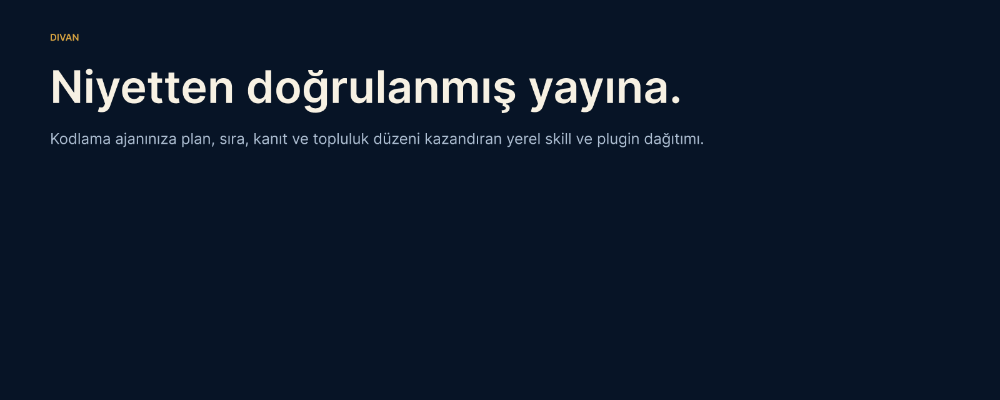

# Divan



[](https://github.com/trugurpala/divan/actions/workflows/quality-gate.yml)
[](https://github.com/trugurpala/divan/releases/latest)
[](LICENSE)
[](#host-compatibility-and-evidence-levels)
[](#free-for-the-community)

[Türkçe](README.tr.md) · **English** · [Wiki](https://github.com/trugurpala/divan/wiki) · [Roadmap](ROADMAP.md) · [Support](SUPPORT.md)

Divan adds a plan, a safe work order, persistent project memory and verifiable
delivery to the coding agent you already use. You describe the outcome in
ordinary language. Divan selects the smallest relevant capability set, keeps
the work visible and refuses to call an unverified result complete.

> **Important limit:** Divan is not a model, a cloud coding service or an
> external agent runtime. It cannot make an unavailable host tool appear, and
> it does not turn an untested claim into evidence.

**Source line:** v1.3.2 · **Published packages:** [GitHub Releases](https://github.com/trugurpala/divan/releases/latest) · **42 skills** ·
**5 modular packages** · **8/8 readiness gates**

**Host compatibility:** [English guide](#host-compatibility) ·
**Local progress:** [Seyir](#follow-progress-locally) ·
**Project rules:** [Community Standards](docs/Topluluk-Standartlari.md)

## Quick links

- [Understand the product](#what-does-divan-do)
- [Choose an installation](#which-installation-should-you-choose)
- [Install with one command](#install-with-one-command)
- [Give Divan its first task](#your-first-real-task)
- [See proof of completion](#what-evidence-does-divan-produce)
- [Ask, report or contribute](#join-the-community)

## What does Divan do?

Divan turns an intent into a bounded plan, implementation steps, checks and a
delivery receipt. It keeps decisions and progress in the project so a new
session can continue from the last verified state. The owner remains the final
authority; Divan calls that role Hükümdar, meaning the project owner.

Use it when you want your coding agent to:

- build or repair a feature without skipping the plan and regression test;
- keep project rules and decisions across sessions;
- select only the skills relevant to the current stack;
- show what is running, blocked, verified or ready;
- connect “done” to tests, files, receipts and publication evidence.

## What does Divan not do?

- It does not replace Claude Code, Codex or another compatible host.
- It does not install every popular repository it discovers.
- It does not send local Seyir data to a cloud service.
- It does not expand project scope without owner authority.
- It does not claim speed or quality gains without a real behavioral evaluation.

## How does it work?

```text
Your request
→ Ferman (bounded brief)
→ plan and task order
→ implementation with the smallest qualified package set
→ Teftiş (tests and evidence review)
→ verified delivery and durable project memory
```

The stdlib-only Divan Engine lives in this repository. Divan Nizamı is the
owner-first governance rule around that engine, not a second product. The
installed [Divan Project Contract](docs/Project-Contract.md) records applicable
rules, goals and evidence inside the target project.

## Which installation should you choose?

| Situation | Choose | What you get |
|---|---|---|
| First installation on a clean computer | Release `divan.pyz` | One verified file; no repository checkout |
| Developing Divan itself | Repository checkout | Source, tests and release tooling |
| Host supports native plugins | Native profile | Commands, skills and host lifecycle |
| Native plugin path cannot be proven | Verified fallback | Skills and instructions only; no false native claims |

Claude Code and Codex are the currently verified native hosts. Other Agent
Skills-compatible hosts can use portable skills only at their documented
evidence level.

## Install with one command

Download `divan.pyz` and its checksum from the same immutable release. Verify
the file, preview the no-write plan, then execute it.

```powershell
$tag = (Invoke-RestMethod "https://api.github.com/repos/trugurpala/divan/releases/latest").tag_name
Invoke-WebRequest "https://github.com/trugurpala/divan/releases/download/$tag/divan.pyz" -OutFile divan.pyz
Invoke-WebRequest "https://github.com/trugurpala/divan/releases/download/$tag/divan.pyz.sha256" -OutFile divan.pyz.sha256
$expected = ((Get-Content .\divan.pyz.sha256 -Raw).Trim() -split "\s+")[0].ToLowerInvariant()
$actual = (Get-FileHash .\divan.pyz -Algorithm SHA256).Hash.ToLowerInvariant()
if ($actual -ne $expected) { throw "Divan bootstrap SHA-256 mismatch" }
python .\divan.pyz doctor --host codex --json
python .\divan.pyz install --host codex --profile auto
python .\divan.pyz install --host codex --profile auto --execute
```

From a trusted checkout, the equivalent two-host lifecycle is:

```powershell
python scripts/divan.py install --host both --ref v1.3.2
python scripts/divan.py install --host both --ref v1.3.2 --execute
python scripts/divan.py doctor --host both --ref v1.3.2
python scripts/divan.py update --host both --ref v1.3.2
python scripts/divan.py update --host both --ref v1.3.2 --execute
python scripts/divan.py recover "C:\Users\you\.divan\transactions\upgrade-20260721-120000.json"
python scripts/divan.py recover "C:\Users\you\.divan\transactions\install-20260721-120000.json"
```

The command above resolves the latest published tag before downloading. The
checkout commands pin the published v1.3.1 tag. See
[removal and recovery](docs/Kaldirma.md) before deleting anything.

The v1.3.1 tag and GitHub Release are the current immutable installation source.

## Your first real task

## Already installed? Start here

You do not need to know package or skill names. Open the project and write:

```text
Divan, take ownership of this task. Verify the current state, make a short plan,
implement the smallest correct change, run the real checks and show me the
evidence in plain language: [describe the outcome]
```

For a project-owned contract, preview and then apply initialization:

```powershell
python scripts/divan.py init --project . --profile standard --locale auto
python scripts/divan.py init --project . --profile standard --locale auto --execute
python scripts/divan.py audit --project . --format json
```

**First setup** is installation and project initialization. Daily use is the
plain-language request above. **Maintenance** is `doctor`, `update`, recovery
or removal; it should not interrupt ordinary task work.

## What will you see?

Divan reports the current outcome, why the active step matters and what comes
next. Technical commands stay secondary unless they explain an error or prove
a result. Work states distinguish ready, running, verifying, blocked and done.
Plain-language progress keeps the user-facing story short while the full
engineering evidence remains available underneath.

## Follow progress locally

Seyir is a read-only local page for goal, task, Git and evidence state. It uses
no cloud service or API key and binds only to `127.0.0.1`.

```powershell
python scripts/divan.py status --project . --open --lang auto
```

Divan prints the exact temporary address and chooses a free port. Stop the
server with `Ctrl+C`; do not reuse an example port from documentation.

## What evidence does Divan produce?


Depending on the task, delivery can include test summaries, changed-file
fingerprints, goal receipts, release checksums, an SPDX SBOM, attestations and
live readback evidence. A verified clean-room task uses:

```powershell
python divan-project.pyz goal advance --project . --goal <goal-id> --to verified --evidence <implementation-file> <test-or-verification-file>
python divan-project.pyz goal advance --project . --goal <goal-id> --to verified --evidence <implementation-file> <test-or-verification-file> --execute
python divan-project.pyz adoption prove --project . --goal <goal-id> --host codex
python divan-project.pyz adoption prove --project . --goal <goal-id> --host codex --execute
python divan-project.pyz adoption verify .divan/adoption/<proof-id>/adoption-receipt.json
```

Only `valid-clean-room-adoption` satisfies that technical gate. It is not an
independent-user count, endorsement, market-adoption claim or quality win.

## Modular packages

| Package | Joins when needed |
|---|---|
| `sadrazam` | End-to-end ownership, durable decisions and bounded delegation |
| `core-pack` | Planning, TDD, debugging, verification and source review |
| `ui-pack` | Interface direction, product audit and browser testing |
| `react-pack` | Detected React, Next.js or React Native work |
| `zanaat-pack` | Creative assets, MCP work and specialist integrations |

All packages remain in this repository. Divan does not require a forked runtime
or a second product repository.

Native Claude Code installations also expose optional command shortcuts:
`/ferman` starts a bounded brief, `/sefer` runs the work order, `/teftis` checks
evidence, `/defter` records durable context, `/vezir` creates a skill,
`/yayin` prepares publication, and the legacy `/company` alias remains for v1
compatibility. Daily use does not require memorizing these names.

## Host compatibility and evidence levels

## Host compatibility

| Level | Meaning | Current examples |
|---|---|---|
| Verified native | Clean install, doctor, update and removal are tested | Claude Code, Codex |
| Portable skill | Agent Skills files can be loaded; native lifecycle is not claimed | Compatible hosts listed in the registry |
| Documented target | Official capability is known but Divan evidence is incomplete | Research entries only |

See the [host compatibility registry](registry/host-compatibility.json) for the
exact host, capability, source and evidence record.

## Security and privacy

Install from an immutable tag, verify checksums and preview writes before
execution. Divan preserves unrelated plugins, records transaction recovery and
fails closed when source identity cannot be proven. Seyir is loopback-only.
Public evidence must remove tokens, email addresses, absolute paths, customer
data and private remote URLs. Report vulnerabilities through the
[private advisory route](SECURITY.md), not a public issue.

## Free for the community

Divan is free and open source under the MIT license. There is no paid tier in
this repository. Hosting providers, model vendors or optional integrations may
have their own pricing; Divan does not hide those external costs.

## Join the community

Ask usage questions in Discussions, report a reproducible defect with the bug
form, propose a source without installing it, or improve a document. The route
finder in [SUPPORT.md](SUPPORT.md) keeps security details private and directs
each contribution to one place.

## Contributing

Start with [CONTRIBUTING.md](CONTRIBUTING.md) and
[GOVERNANCE.md](GOVERNANCE.md). The canonical local gate is:

```bash
python scripts/verify.py
git diff --check
```

Structural validation covers all 42 skills. The current evaluation contract is
exact: five original skills provide 16 behavioral cases. A real adapter and
blinded judge are still required before a behavioral improvement claim can be
made.

## Roadmap and project documents

- [Roadmap](ROADMAP.md)
- [Product direction and history](BLUEPRINT.md)
- [Writing and style contract](docs/Yazim-ve-Uslup.md)
- [Release process](RELEASE.md)
- [Visual system](docs/Gorsel-Sistem.md)
- [License and source inventory](THIRD_PARTY_LICENSES.md)

## Latest release and verification

The [GitHub Releases page](https://github.com/trugurpala/divan/releases/latest)
is the authority for the latest published package. The immutable v1.3.1
publication evidence is recorded in
`.divan/evidence/teftis-20260801-v131-release.md`; every new release must add its
own checksum, SPDX SBOM, attestation and live-readback evidence.

The readiness score is **8/8**. That score describes machine-backed technical
gates, not popularity or market adoption.

## Visual system and Figma source

The visual direction uses midnight blue, ivory, turquoise, coral and gold with
restrained İznik geometry. Open the editable
[Figma source](https://www.figma.com/design/Z325Jjy36I7KLdizcaZAnZ) or read the
[production export rules](docs/Gorsel-Sistem.md).

## License and upstream attribution

Divan is licensed under [MIT](LICENSE). Third-party origins, immutable pins,
local adaptations and license boundaries are recorded in [UPSTREAM.md](UPSTREAM.md)
and [THIRD_PARTY_LICENSES.md](THIRD_PARTY_LICENSES.md). A source appearing in
the candidate council does not mean it was installed or adopted.
